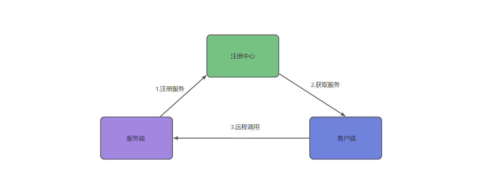
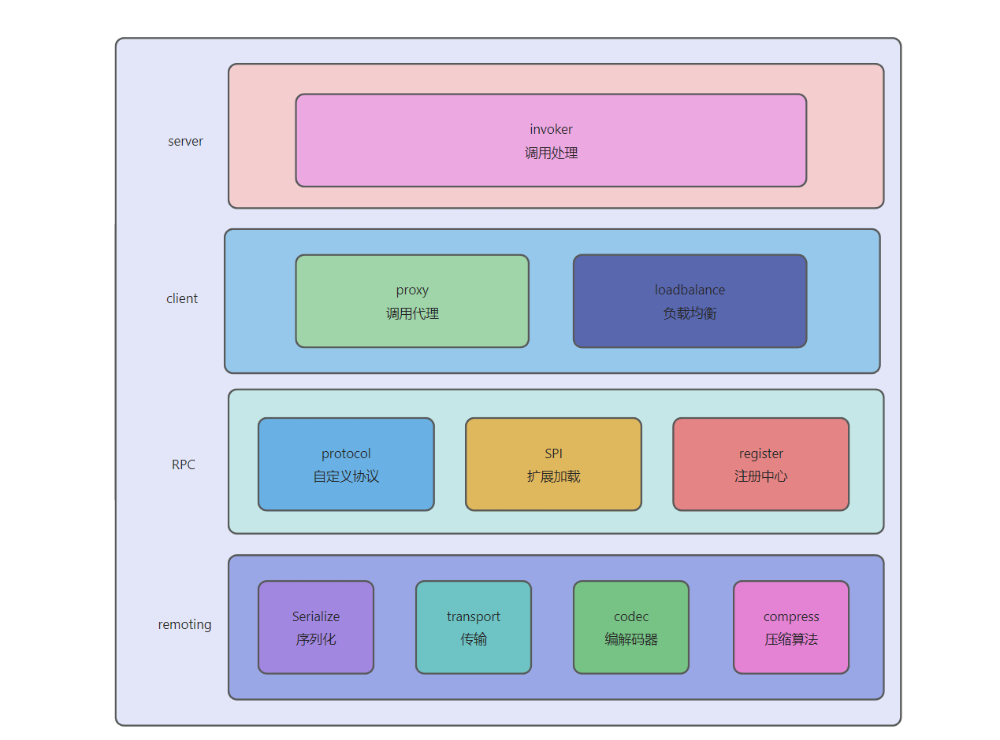

## 项目介绍

zhi-rpc是一款基于Java、Netty、Zookeeper实现的RPC通信框架，它具有以下核心特性：

1. 采用“微内核+可插拔”架构，通过自定义SPI加载机制，支持延迟加载与缓存，可动态替换扩展点组件

2. 灵活使用设计模式提高系统可扩展性、可维护性，如单例模式、工厂模式、抽象模版模式、建造者模式

3. 实现服务调用负载均衡机制，支持轮询、随机、一致性哈希负载均衡算法，优化调用体验

4. 通过自定义通信协议、支持多种序列化方式，同时实现Gzip压缩，提升网络传输效率

## 基本原理



## 项目架构



## 目录结构

```bash
zhi-rpc
├── zhi-rpc-api      // api接口
├── zhi-rpc-client   // 客户端模块
├── zhi-rpc-common   // 通用模块
├── zhi-rpc-server   // 服务端模块
├── zhi-rpc-simple   // 核心模块
```

## 快速开始

1. 接口定义（参考`zhi-rpc-api` 模块）：

   ```Java
   public interface HelloService {
   	String hello(Hello hello);
   }
   
   public class Hello implements Serializable {
       private String message;
       private String description;
   }
   ```

2. 接口实现（参考`zhi-rpc-server`模块）：

   ```Java
   @Slf4j
   @RpcService(group = "test1", version = "version1")
   public class HelloServiceImpl implements HelloService {
   
       static {
           System.out.println("HelloServiceImpl被创建");
       }
   
       @Override
       public String hello(Hello hello) {
           log.info("HelloServiceImpl收到: {}", hello.getMessage());
           String result = "Hello description = " + hello.getDescription();
           log.info("HelloServiceImpl返回: {}", result);
           return result;
       }
   }
   ```

3. 服务注册（参考`zhi-rpc-server`模块）：

   ```Java
   @RpcScan(basePackage = {"com.dezhi"})
   public class NettyServerMain {
       public static void main(String[] args) {
           AnnotationConfigApplicationContext applicationContext = new AnnotationConfigApplicationContext(NettyServerMain.class);
           NettyRpcServer nettyRpcServer = (NettyRpcServer) applicationContext.getBean("nettyRpcServer");
           HelloServiceImpl2 helloService2 = new HelloServiceImpl2();
           RpcServiceConfig rpcServiceConfig = RpcServiceConfig.builder()
                   .group("test2")
                   .version("version2")
                   .service(helloService2).build();
           nettyRpcServer.registerService(rpcServiceConfig);
           nettyRpcServer.start();
       }
   }
   ```

4. 服务调用（参考`zhi-rpc-client`模块）：

   ```Java
   @Component
   public class HelloController {
   
       @RpcReference(version = "version1", group = "test1")
       private HelloService helloService;
   
       public void test() throws InterruptedException {
           String hello = this.helloService.hello(new Hello("111", "222"));
           System.out.println(hello);
       }
   }
   
   @RpcScan(basePackage = "com.dezhi")
   public class NettyClientMain {
       public static void main(String[] args) throws InterruptedException {
           AnnotationConfigApplicationContext applicationContext = new AnnotationConfigApplicationContext(NettyClientMain.class);
           HelloController helloController = (HelloController) applicationContext.getBean("helloController");
           helloController.test();
       }
   }
   ```

   

   

